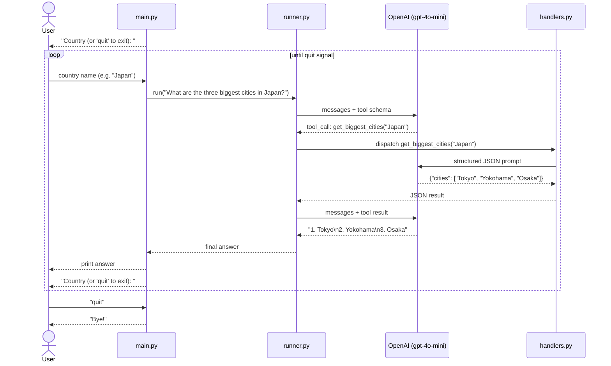

# OpenAI SDK Agent Demo

An OpenAI function-calling agent that returns the three biggest cities of a given country, sorted by population. City data is fetched dynamically via a dedicated OpenAI call — no static list, no extra library.

## Structure

```
openai-sdk-demo/
├── agent/
│   ├── __init__.py   # public API: run()
│   ├── tools.py      # tool schema sent to the model
│   ├── handlers.py   # tool logic — calls OpenAI to fetch city data
│   └── runner.py     # agent loop
├── main.py           # CLI entry point
└── requirements.txt
```

## Setup

```powershell
pip install -r requirements.txt
$env:OPENAI_API_KEY = "sk-..."
```

```bash
pip install -r requirements.txt
export OPENAI_API_KEY="sk-..."
```

## Usage

```shell
# Interactive
python main.py
```

```python
# As a library
from agent import run
print(run("Three biggest cities in France?"))
```

## Example output

```
=== Biggest Cities Agent ===
Country (or 'quit' to exit): GUINEE

The three biggest cities in Guinea are:

1. Conakry
2. Nzérékoré
3. Kankan

Country (or 'quit' to exit): IVORY COST

The three biggest cities in Ivory Coast are:

1. Abidjan
2. Bouaké
3. San Pedro

Country (or 'quit' to exit): Benin

The three biggest cities in Benin are:

1. Cotonou
2. Porto-Novo
3. Djougou

Country (or 'quit' to exit): Maroc

The three biggest cities in Morocco are:

1. Casablanca
2. Rabat
3. Marrakech

Country (or 'quit' to exit): quit
Bye!
```

## How it works



## Adding a new tool

1. Add its JSON schema to `tools.py`.
2. Register its handler in `TOOL_HANDLERS` in `handlers.py`.
