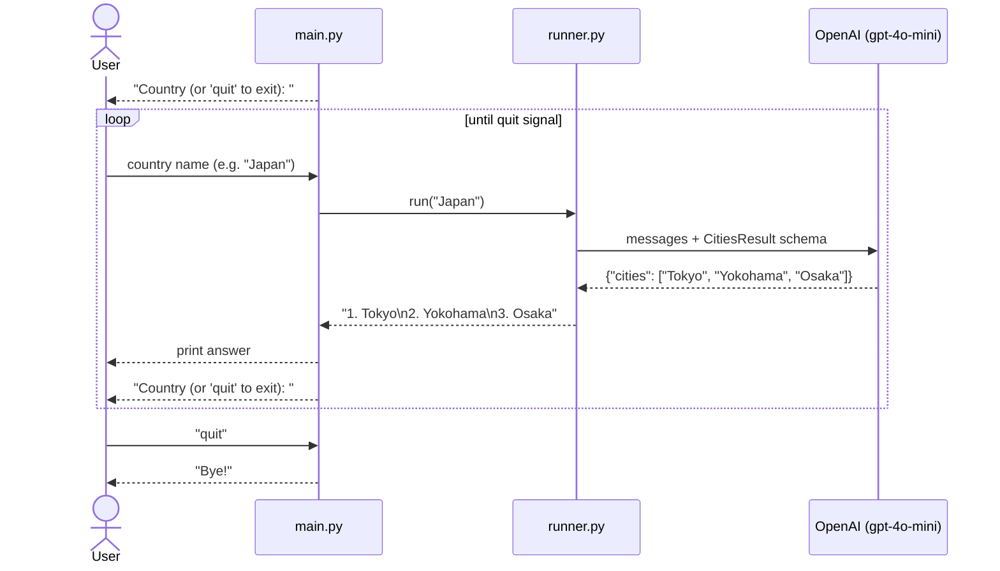

# OpenAI SDK Agent Demo — Structured Output

Returns the three biggest cities of a given country using a **single OpenAI call** with structured output (Pydantic). No tool schema, no agent loop, no dispatch layer.

> See branch `master` for the tool-calling / agent-loop version.

## Structure

```
openai-sdk-demo/
├── agent/
│   ├── __init__.py   # public API: run(country)
│   └── runner.py     # single structured-output call
├── main.py           # interactive CLI loop
└── requirements.txt
```

## Setup

```powershell
pip install -r requirements.txt
$env:OPENAI_API_KEY = "sk-..."
```

```bash
pip install -r requirements.txt
export OPENAI_API_KEY="sk-..."
```

## Usage

```shell
python main.py
```

```python
from agent import run
print(run("France"))
```

## Example output

```
=== Biggest Cities Agent ===
Country (or 'quit' to exit): Japan

1. Tokyo
2. Yokohama
3. Osaka

Country (or 'quit' to exit): quit
Bye!
```

## How it works



## Approach comparison

| | `master` (tool calling) | this branch (structured output) |
| --- | --- | --- |
| OpenAI calls per query | 2 | 1 |
| Files | 4 | 2 |
| Extensible with new tools | Yes | No |
| Output validation | Via tool schema | Via Pydantic model |
