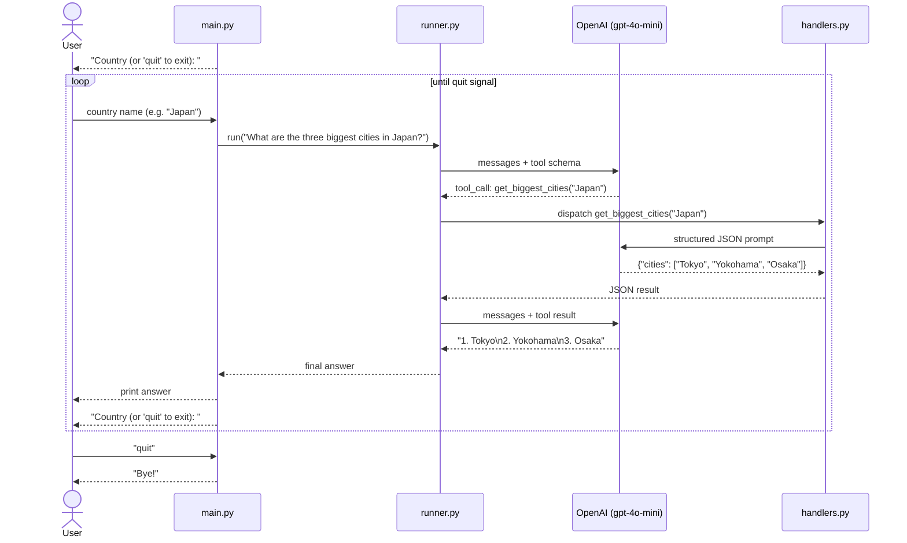

# OpenAI SDK Agent Demo

An OpenAI function-calling agent that returns the three biggest cities of a given country, sorted by population. City data is fetched dynamically via a dedicated OpenAI call — no static list, no extra library.

> See branch `feature/structured-output-only` for the single-call Pydantic version.

## Structure

```
openai-sdk-demo/
├── agent/
│   ├── __init__.py   # public API: run()
│   ├── config.py     # model, prompts, and tuneable parameters
│   ├── tools.py      # tool schema sent to the model
│   ├── handlers.py   # tool logic — calls OpenAI to fetch city data
│   └── runner.py     # agent loop
├── main.py           # interactive CLI loop
└── requirements.txt
```

## Setup

```powershell
pip install -r requirements.txt
$env:OPENAI_API_KEY = "sk-..."
```

```bash
pip install -r requirements.txt
export OPENAI_API_KEY="sk-..."
```

## Usage

```shell
python main.py
```

```python
from agent import run
print(run("What are the three biggest cities in France?"))
```

## Example output

```
=== Biggest Cities Agent ===
Country (or 'quit' to exit): Japan

1. Tokyo
2. Yokohama
3. Osaka

Country (or 'quit' to exit): quit
Bye!
```

## Configuration

All tuneable parameters are in `agent/config.py`:

| Parameter | Default | Purpose |
| --- | --- | --- |
| `MODEL` | `gpt-4o-mini` | OpenAI model used for all calls |
| `TOP_N` | `3` | Number of cities returned |
| `AGENT_SYSTEM_PROMPT` | `"You are a helpful assistant..."` | Agent loop persona |
| `DATA_SYSTEM_PROMPT` | `"You are a geography expert..."` | Data-fetch call persona |

## How it works



## Adding a new tool

1. Add its JSON schema to `tools.py`.
2. Register its handler in `TOOL_HANDLERS` in `handlers.py`.
